# Data Lovers

<!-- ## Índice

* [Preámbulo](#preámbulo)
* [Descripción](#resumen-del-proyecto)
* [Consideraciones generales](#consideraciones-generales)
* [Objetivos de aprendizaje](#objetivos-de-aprendizaje)
* [Parte obligatoria](#parte-obligatoria)
* [Parte opcional](#parte-opcional-hacker-edition)
* [Consideraciones técnicas](#consideraciones-técnicas)
* [Primeros pasos](#primeros-pasos)
* [Contenido de referencia](#contenido-de-referencia)
* [Checklist](#checklist)

***
 -->
## Preámbulo

Dos años después, la emoción del juego Pokemon Go sigue con más poder en los aficionado que en cualquier otro momento desde el lanzamiento del juego del verano 2016. El cazador como se le llama al usuario en el juego,  busca, captura y  en entrena a los pokémones escondidos en el mundo real, para luchar por el control de "gimnasios" virtuales desplegados en lugares del mundo real que aparecen en los mapas de los smartphones. En este juego los creadores consideraron meter a solo 151 pokemones originales porque habría sido muy intrincado para atraer a nuevos fans meter a los  726 que hay en total.

En total hay 18 tipos de pokémon, cada tipo generalmente corresponde a un hábitat específica, de manera que los pokémons de tipo agua está precisamente en un hábitat con agua.
Un buen cazador cazador debe conocer bien  el tipo de sus pokémones para calcular cual es más fuerte o débil frente a otro en una batalla. No obstante puede ser un poco confuso para los novatos por la gran cantidad de pokemones.

## Entrevista

Comenzamos con una entrevista  a los usuarios de Pokemon Go para obtener la información sobre sus necesidades a la hora de Jugar Pokemon Go y nos ayudó  a  representar todo lo que el usuario necesitará ver o hacer en nuestro producto en las historias de usuarios. Formulamos las siguientes preguntas para llegar a dicha información:

* **Preséntate: genera confianza.**
Hola soy Micaela/Ivana, ¿cómo estás?
¿De dónde eres?, ¿cómo fue tu día hoy?
Este periodo de tiempo, lo que quiero es que conversemos acerca de qué necesitarías para ser mejor entrenador Pokémon.

* **Busca historias.**
	¿Me puedes platicar cuál es tu manera de elegir un Pokemon?
¿Qué necesitarías ver o saber exactamente de los Pokemones? ¿por qué?

* **Hablen sobre sentimientos.**
	¿Cuéntame sobre tu última experiencia que jugaste Pokemon Go? ¿fue buena, mala? ¿por qué dices eso?

* **Preguntas más específicas para profundizar más sobre las necesidades del usuario en el juego de Pokemon.**

En este periodo de tiempo lo que quiero es que platiquemos acerca de  qué información necesitarías para ser mejor jugador Pokémon.

1. ¿Cuáles son tus maneras de elegir un pokemon?
Conocer su nivel, tipo de ataque y si pueden evolucionar.
2. ¿Qué necesitarías ver o saber exactamente sobre un pokemon?
Saber qué tipo es, si de agua o fuego por ejemplo.
Si todavía puede evolucionar.
Si un huevo va explotar.
La cantidad de caramelos para que evolucione.
Si determinado pokémon contrarresta a otros en el gimnasio.

### Encuesta 
***

Para complementar más las investigación sobre la necesidades de los usuarios del juego Pokemon Go, hicimos una **encuesta** con la herramienta google forms para jerarquizar la información más relevante que desea saber el público objetivo.

[Encuesta](https://docs.google.com/forms/d/e/1FAIpQLSeosWC9LZtFqn39gnxNlxbC6KX5aiEcmkozPMS-CCaWYBS4Dw/viewform)

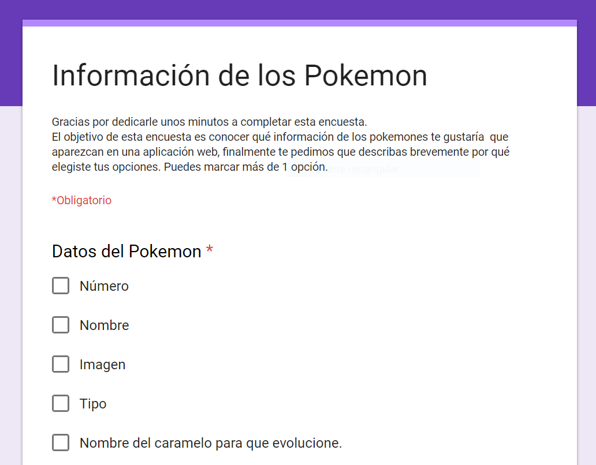

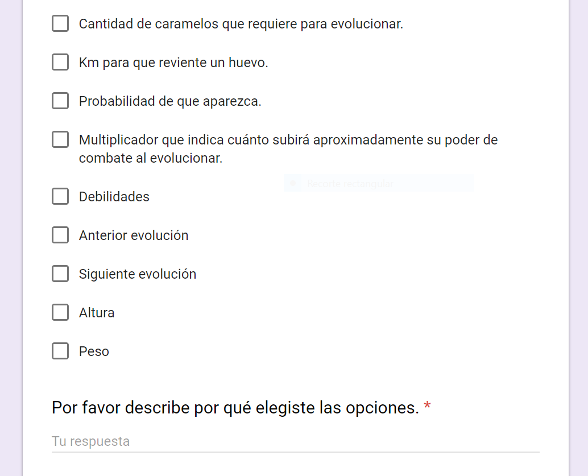


**Obtuvimos los siguientes resultados:**

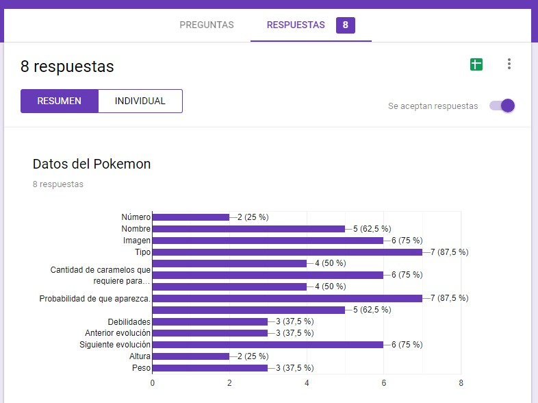
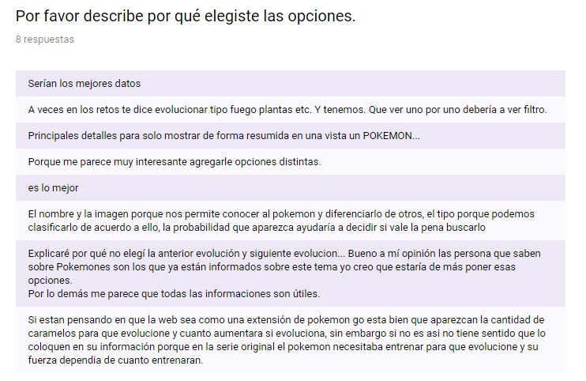

## Historias de usuario

**Yo como:** usuario de la página web.  

**Quiero:** ver número, nombre, imagen, tipo, y probabilidad que aparezca.

**Funcionalidad:** para tener una vista rápida de la información disponible de los pokemones.

***

**Yo como**: usuario de la página web.

**Quiero**: filtrar por tipo a los Pokémon.

**Funcionalidad**: para identificarlo, conocerlo y para saber si un Pokémon es de más de 1 tipo.        

***

**Yo como**: usuario de la página web.

**Quiero**: ordenar  Pokémon por nombre ascendente y descendentemente.

**Funcionalidad**: para conocerlos y me ayuda a aprender los nombres.

***

**Yo como**: usuario de la página web.      

**Quiero**: ver el Pokémon que tiene la mayor y menor cantidad de caramelos.    

**Funcionalidad**: para conocer cuántos caramelos necesita para evolucionar.        
***

## Diseño de la Interfaz de Usuario


Luego de las entrevista  realizamos un sketch o boceto de lo que sería el producto teniendo en cuenta la necesidad principal del usuario que era conocer todos los tipos de pokemons y saber si un pokémon tiene más de un tipo.

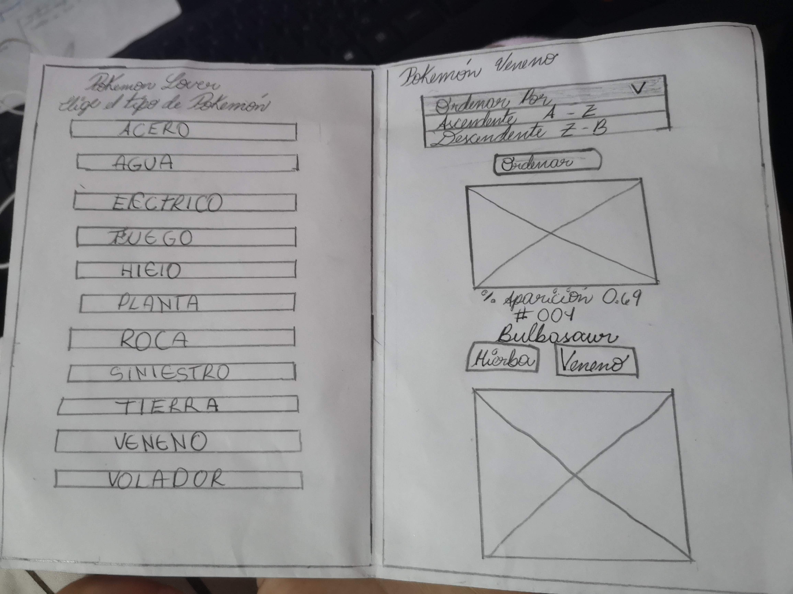


Teniendo los sketchs ya mencionados, creímos conveniente realizar una **segunda entrevista** para mejorar el prototipo
Para mejorar el prototipo de baja fidelidad pasamos a realizar una prueba de testeo y detectamos los siguientes problemas:

* Los usuarios quieren ver primero toda la lista de pokémons sin ningún filtro.
* Un cálculo sobre que pokemones necesitan más o menos caramelos para evolucionar y se filtre justo en el mismo botón donde se filtra por Asc. A-Z.

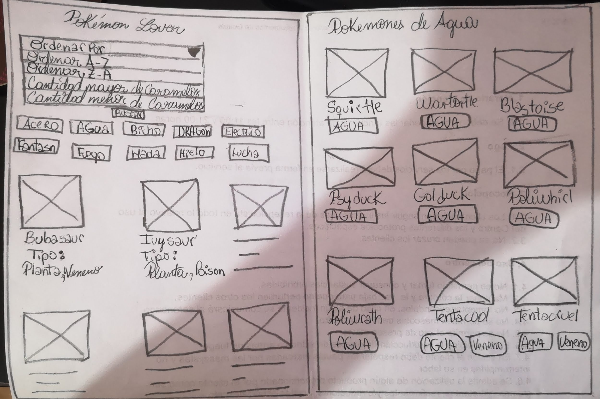


### Prototipo de alta fidelidad

Diseñamos un prototipo con la Herramienta [_Figma_](https://www.figma.com/)


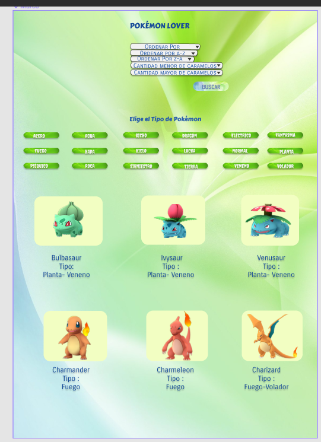


 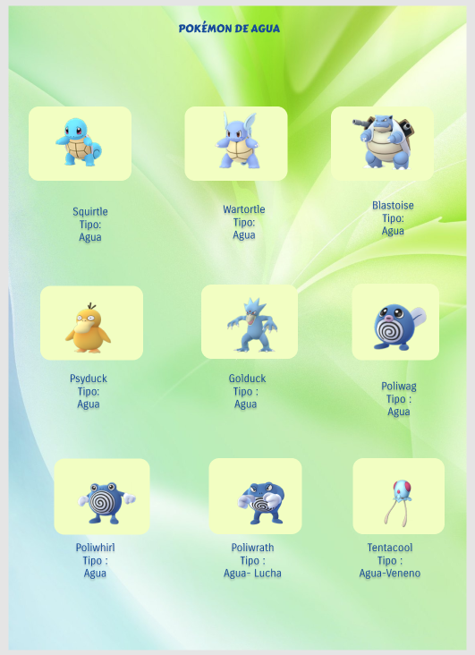


Al testear nuestro protrotipo lo usarios nos sugirieron las siguientes mejoras: 
* Hacer más interactivo el prototipo en especial la forma del select porque parecian ser varios select o botones.
* Eliminar el botón de buscar porque al dar click en las opciones del select automáticamente se ordena.
* Y por ultimo dar un color mas oscuro al los botones de tipos de pokemones para hacer mas contrastes con las letras.

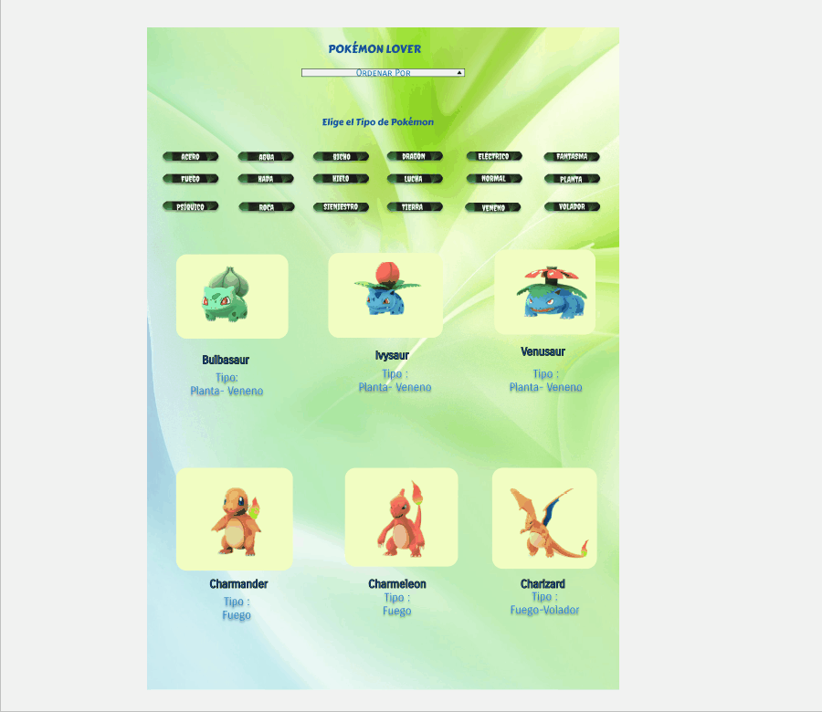

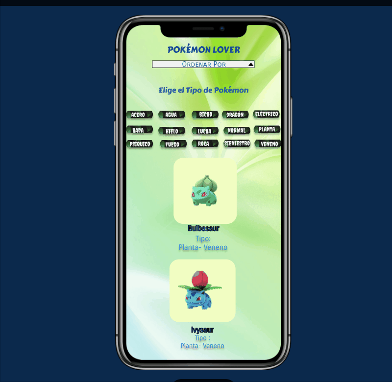

### Paleta de Colores

Muchos usuarios y compañeras nos recomendaron elegir una paleta de colores para ser más amigable. Utilizamos la herramienta de Adobe Color CC. Se importo la imagen del logo para obtener sus colores, y en base a esos colores obtuvismos las paleta de colores.

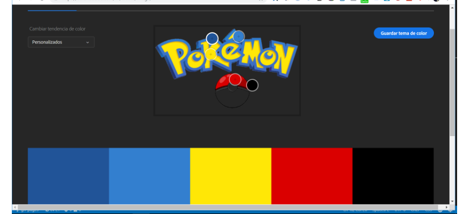


**Y sus códigos Hex son:**


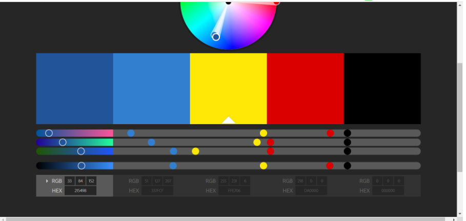

<!-- El objetivo principal de este proyecto es que aprendas a diseñar y construir una
interfaz web donde se pueda visualizar y manipular data, entendiendo lo que el
usuario necesita.

Dicho en palabras sencillas, aprenderás a:

* Aplicar y profundizar todo lo que aprendiste en el proyecto anterior.
* Pensar en las **necesidades de los usuarios** para crear historias de usuario.
* Escribir y trabajar con **historias de usuario**, sus definiciones de
  terminado (_definition of done_) en la organización y planificación de tu
  trabajo.
* Definir qué data y de qué forma mostrarla en el producto, basándote en
  tu **entendimiento del usuario**.
* Crear productos que sigan los **principios básicos de diseño visual** y
  las **heurísticas de usabilidad**.
* Iterar el diseño del producto, basándote en los resultados de los
  **tests de usabilidad**.
* Manipular **_arreglos_ (_arrays_) y _objetos_ (_objects_)**.
* **Manipular el DOM** (agregar elementos dinámicamente basados en la data).
* **Manejar eventos del DOM** para permitir interacción con el usuario
  (filtrado, ordenado, ...).
* Entender los beneficios y complejidades de **trabajar en equipo** en un
  ambiente de incertidumbre.

## Parte Obligatoria

Los criterios para considerar que has completado este proyecto son:

### Definición del producto

Documenta brevemente tu trabajo en el archivo `README.md` de tu repositorio,
contándonos cómo fue tu proceso de diseño y cómo crees que el producto resuelve
el problema (o problemas) que tiene tu usuario.

### Historias de usuario

Una vez que entiendas las necesidades de tu usuario, escribe las [Historias
de Usuario](https://es.wikipedia.org/wiki/Historias_de_usuario) que representen
todo lo que el usuario necesita hacer/ver. Asegúrate de incluir una definición
de terminado (_definition o done_) para cada una.

### Diseño de la Interfaz de Usuario

#### Prototipo de baja fidelidad

Durante tu trabajo deberás haber hecho e iterado sketches (boceto) de tu
solución usando papel y lápiz. Te recomendamos tomar fotos de todas las
iteraciones que realices, y las subas a tu repositorio, y las menciones en tu
`README.md`.

#### Prototipo de alta fidelidad

Lo siguiente es diseñar tu Interfaz de Usuario (UI por sus siglas en inglés -
_User Interface_). Para eso debes aprender a utilizar alguna herramienta de
diseño visual. Nosotros te recomendamos [Figma](https://www.figma.com/) que es
una herramienta que funciona en el navegador y, además, puedes crear una cuenta
gratis. Sin embargo, eres libre de utilizar otros editores gráficos como
Illustrator, Photoshop, PowerPoint, Keynote, etc. Recuerda utilizar la identidad
gráfica correspondiente a cada set de datos que elijas.

El diseño debe representar el _ideal_ de tu solución. Digamos que es lo que
desearías implementar si tuvieras tiempo ilimitado para hackear. Además, tu
diseño debe seguir los fundamentos de _visual design_. También, deberás exportar
tu diseño a [Zeplin](https://zeplin.io/) y utilizar las especificaciones de
estilo que te dé Zeplin al momento de implementar tus diseños en código.

#### Testeos de usabilidad

Durante el reto deberás realizar tests de usabilidad con distintos usuarios, y
en base a los resultados de esos tests, deberás iterar tus diseños. Cuéntanos
qué problemas de usabilidad detectaste a través de los tests y cómo los
mejoraste en tu propuesta final.

### Implementación de la Interfaz de Usuario (HTML/CSS/JS)

Luego de diseñar tu interfaz de usuario deberás trabajar en su implementación.
Como mencionamos, **no** es necesario que construyas la interfaz tal como la
diseñaste. Tendrás un tiempo limitado para hackear, así es que deberás
priorizar.

Como mínimo, tu implementación debe:

1. Mostrar la data en una interfaz: puede ser un card, una tabla, una lista, etc.
2. Permitir al usuario filtrar y ordenar la data.
3. Calcular estadísticas de la colección (o subcolección) como media aritmética,
   máximo y/o mínimo de algún atributo numérico, o contar cuántas veces aparece
   un determinado valor, por ejemplo.
4. Visualizarse sin problemas desde distintos tamaños de pantallas: móviles,
   tablets y desktops.

Es importante que tu interfaz, a pesar de ser una versión mínima de tu ideal,
siga los fundamentos de _visual design_.

### Pruebas unitarias

El _boilerplate_ de este proyecto no incluye pruebas unitarias, pero esperamos
que escribas tu propias pruebas unitarias para las funciones encargadas de
_procesar_, _filtrar_ y _ordenar_ la data, así como _calcular_ estadísticas.
Para ello te recomendamos implementar las siguientes funciones en el archivo
`src/data.js`:

* `filterData(data, condition)`: esta función `filter` o filtrar recibiría la
  data, y nos retornaría aquellos datos que sí cumplan con la condición.

* `sortData(data, sortBy, sortOrder)`: esta función `sort` u ordenar
  recibe tres parámetros.
  El primer parámetro, `data`, nos entrega los datos.
  El segundo parámetro, `sortBy`, nos dice con respecto a cuál de los campos de
  la data se quiere ordenar.
  El tercer parámetro, `sortOrder`, indica si se quiere ordenar de manera
  ascendente o descendente.

* `computeStats(data)`: la función `compute` o calcular, nos permitirá hacer
  cálculos estadísticos básicos para ser mostrados de acuerdo a la data
  proporcionada.

Estas son ideas de funciones que podrías implementar, pero esto depende de tu
propia implementación.

El archivo `src/data.js` tiene que tener una cobertura del 70% de _statements_
(_sentencias_), _functions_ (_funciones_), _lines_ (_líneas_), y _branches_
(_ramas_).

Estas funciones deben ser [_puras_](https://medium.com/laboratoria-developers/introducci%C3%B3n-a-la-programaci%C3%B3n-funcional-en-javascript-parte-2-funciones-puras-b99e08c2895d)
e independientes del DOM. Estas funciones serán después usadas desde el archivo
`src/main.js`, al cargar la página, y cada vez que el usuario interactúe (click,
filtrado, ordenado, ...).

## Parte Opcional (Hacker edition)

Features/características extra sugeridas:

* En lugar de consumir la data estática brindada en este repositorio, puedes
  consumir la data de forma dinámica, cargando un archivo JSON por medio de
  `fetch`. La carpeta `src/data` contiene una versión `.js` y una `.json` de
  de cada set datos.
* Agregarle a tu interfaz de usuario implementada visualizaciones gráficas. Para
  ello te recomendamos explorar librerías de gráficas como [Chart.js](https://www.chartjs.org/)
  o [Google Charts](https://developers.google.com/chart/).
* 100% Coverage

## Consideraciones técnicas

La lógica del proyecto debe estar implementada completamente en JavaScript
(ES6), HTML y CSS. En este proyecto NO está permitido usar librerías o
frameworks, solo [vanilla JavaScript](https://medium.com/laboratoria-how-to/vanillajs-vs-jquery-31e623bbd46e),
con la excepción de librerías para hacer gráficas (charts); ver
[_Parte opcional_](#parte-opcional-hacker-edition) más arriba.

No se debe utilizar la _pseudo-variable_ `this`.

El _boilerplate_ contiene una estructura de archivos como punto de partida así
como toda la configuración de dependencias:

```text
.
├── package.json
├── README.md
├── src
│   ├── data
│   │   ├── injuries
│   │   │   ├── injuries.js
│   │   │   └── injuries.json
│   │   ├── lol
│   │   │   ├── lol.js
│   │   │   └── lol.json
│   │   ├── pokemon
│   │   │   ├── pokemon.js
│   │   │   └── pokemon.json
│   │   ├── steam
│   │   │   ├── steam.js
│   │   │   └── steam.json
│   │   └── worldbank
│   │       ├── worldbank.js
│   │       └── worldbank.json
│   ├── data.js
│   ├── index.html
│   ├── main.js
│   └── style.css
└── test
    └── data.spec.js

8 directories, 17 files
```

### `src/index.html`

Al igual que en el proyecto anterior, existe un archivo `index.html`. Como ya
sabrás, acá va la página que se mostrará al usuario. También nos sirve para
indicar qué scripts se usarán y unir todo lo que hemos hecho.

En este archivo encontrarás una serie de _etiquetas_ (_tags_) `<script>`
_comentadas_. Para _cargar_ las diferentes fuentes de datos tendrás que
_descomentar_ estas _etiquetas_. Cada uno estos scripts asignará una variable
global con la data correspondiente a esa fuente de datos.

Por ejemplo, si descomentamos la siguiente línea:

```html
<!-- <script src="./data/worldbank/worldbank.js"></script> -->
<!-- ```

<!-- <!-- La línea quedaría así:

```html
<script src="./data/worldbank/worldbank.js"></script>
``` -->

<!-- Y ahora tendríamos la variable global `WORLDBANK` disponible en nuestros otros
scripts (como `src/data.js` o `src/main.js`).

### `src/main.js`

Recomendamos usar `src/main.js` para todo tu código que tenga que ver con
mostrar los datos en la pantalla. Con esto nos referimos básicamente a la
interacción con el DOM. Operaciones como creación de nodos, registro de
manejadores de eventos (_event listeners_ o _event handlers_), ....

Esta no es la única forma de dividir tu código, puedes usar más archivos y
carpetas, siempre y cuando la estructura sea clara para tus compañeras.

### `src/data.js`

El corazón de este proyecto es la manipulación de datos a través de arreglos y
objetos. La idea de este archivo es contener toda la funcionalidad
que corresponda a obtener, procesar y manipular datos.

En este archivo esperamos que implementes las funciones detalladas en la sección
de [_Pruebas Unitarias_](#pruebas-unitarias).

### `src/data`

En esta carpeta están los datos de las diferentes fuentes. Encontrarás una
carpeta por cada fuente, y dentro de cada carpeta dos archivos: uno con la
extensión `.js` y otro `.json`. Ambos archivos contienen la misma data; la
diferencia es que el `.js` lo usaremos a través de una etiqueta `<script>`,
mientras que el `.json` está ahí para opcionalmente cargar la data de forma
asíncrona con [`fetch()`](https://developer.mozilla.org/es/docs/Web/API/Fetch_API)
(ver sección de [_Parte Opcional_](#parte-opcional-hacker-edition)).

### `test/data.spec.js`

Tendrás también que completar las pruebas unitarias de las funciones
implementadas en el archivo `data.js`.

## Evaluación

Recuerda revisar la [rúbrica](https://docs.google.com/spreadsheets/u/1/d/e/2PACX-1vRktPN4ilZtkRN5tUb3DVhgeihwlzk63_-JI3moA-bXpKDbHDioAK2H3qbrwWNb0Ql4wX22Tgv7-PDv/pubhtml)
para ver la descripción detallada de cada habilidad y cada nivel. Esta es una
lista de todas las habilidades involucradas en este proyecto y que evaluaremos
cuando lo completes:

### General

| Característica/Habilidad |
|--------------------------|
| Completitud | -->

<!-- ### Tech

| Habilidad |
|-----------|
| **JavaScript** |
| Estilo |
| Nomenclatura/semántica |
| Funciones/modularidad |
| Estructuras de datos |
| Tests |
| **HTML** |
| Validación |
| Estilo |
| Semántica |
| **CSS** |
| DRY |
| Responsive |
| **SCM** |
| Git |
| GitHub |
| **CS** |
| Lógica |
| Arquitectura |

### UX

| Habilidad |
|-----------|
| User Centricity |
| Entrevistas |
| Contraste |
| Alineación |
| Jerarquía |
| Tipografía |
| Color |

### Habilidades Blandas

| Habilidad |
|-----------|
| Planificación y organización |
| Autoaprendizaje |
| Solución de problemas |
| Dar y recibir feedback |
| Adaptabilidad |
| Trabajo en equipo |
| Comunicación eficaz |
| Presentaciones |

*** -->

<!-- ## Pistas sobre cómo empezar a trabajar en el proyecto

Antes de empezar a escribir código, debes definir qué deberá hacer el producto
en base al conocimiento que puedas obtener de tu usuario. Estas preguntas te
pueden ayudar:

* ¿Quiénes son los principales usuarios de producto?
* ¿Cuáles son los objetivos de estos usuarios en relación con el producto?
* ¿Cuáles son los datos más relevantes que quieren ver en la interfaz y por qué?
* ¿Cuándo utilizan o utilizarían el producto?
 -->
<!-- Cuando ya estés lista para codear, te sugerimos empezar de esta manera:

1. Una de las integrantes del equipo debe realizar un :fork_and_knife:
   [fork](https://help.github.com/articles/fork-a-repo/) del repo de tu cohort,
   tus _coaches_ te compartirán un _link_ a un repo y te darán acceso de lectura
   en ese repo. La otra integrante del equipo deber hacer un fork **del
   repositorio de su compañera** y [configurar](https://gist.github.com/BCasal/026e4c7f5c71418485c1)
   un `remote` hacia el mismo.
2. :arrow_down: [Clona](https://help.github.com/articles/cloning-a-repository/)
   tu _fork_ a tu computadora (copia local).
3. 📦 Instala las dependencias del proyecto con el comando `npm install`. Esto
   asume que has instalado [Node.js](https://nodejs.org/) (que incluye [npm](https://docs.npmjs.com/)).
4. Si todo ha ido bien, deberías poder ejecutar las :traffic_light:
   pruebas unitarias (unit tests) con el comando `npm test`.
5. A codear se ha dicho! :rocket: --> 
<!--
En este proyecto deberás trabajar colaborativamente. Para ello, una de las
integrantes del equipo deberá forkear el repositorio del cohort y la otra
integrante **deberá hacer un fork del repositorio de su compañera**. Luego de
esto, deberás
[configurar](https://help.github.com/articles/configuring-a-remote-for-a-fork/)
un `remote` hacia el repositorio del cual hiciste el fork.

Para mandar cambios desde un repositorio forkeado al original debes crear un
[pull request](https://goo.gl/4bYnuh)
y el propietario del repositorio original recibirá una notificación para
[revisar el pull request](https://goo.gl/XSFcT5)
y [aceptar los cambios](https://goo.gl/HLJtqN).

Aquí algunas recomendaciones para que organices mejor el trabajo con tu
compañera:

* En lugar de trabajar en una sola rama o _branch_, puedes organizar el flujo de
  trabajo con dos ramas principales:
  - `master`: rama que contiene las funcionalidades terminadas y sin errores.
  - `develop`: rama dónde integrarás las funcionalidades conforme las vayas
    desarrollando.

* Además de tener las dos ramas anteriores, puedes trabajar cada nueva
  funcionalidad en una rama individual (_feature branches_), estas ramas en
  lugar de crearse a partir de `master`, tienen a `develop` como su rama de
  origen. Cuando una funcionalidad es terminada se integra de nuevo a `develop`.
  Las _feature branches_ no se deben integrar directamente a `master`.

* Por último, te sugerimos codear usando la técnica de
  [pair programming](https://goo.gl/uAMBX2).

¿Quieres saber más forks y pull requests?

* Un [fork](https://help.github.com/articles/fork-a-repo/) es una copia de un
  repositorio en el que puedes experimentar sin afectar al repositorio original.
  Generalmente se usa para proponer cambios al proyecto de alguien más o para
  usar el proyecto de otra persona como punto de partida para una idea que
  quieras realizar.

* Un [pull request](https://help.github.com/articles/about-pull-requests/) (PR)
  te permite solicitar la inclusión de cambios al repositorio original (tu punto
  de partida) en GitHub. Cuando un PR es abierto, este permite solicitar,
  discutir y revisar los cambios realizados con todos los colaboradores y
  agregar otros commits antes de que los cambios sean incluidos al repositorio
  original.
-->

<!-- ***

## Contenido de referencia

### Diseño de experiencia de usuario (User Experience Design)

* Investigación con usuarios / entrevistas
* Principios de diseño visual

### Desarrollo Front-end

* Unidad de testing en curso de JavaScript en LMS.
* Unidad de arreglos en curso de JavaScript en LMS.
* Unidad de objetos en curso de JavaScript en LMS.
* Unidad de funciones en curso de JavaScript en LMS.
* Unidad de DOM en curso de Browser JavaScript en LMS.
* [Array en MDN](https://developer.mozilla.org/es/docs/Web/JavaScript/Referencia/Objetos_globales/Array)
* [Array.sort en MDN](https://developer.mozilla.org/es/docs/Web/JavaScript/Referencia/Objetos_globales/Array/sort)
* [Array.map en MDN](https://developer.mozilla.org/es/docs/Web/JavaScript/Referencia/Objetos_globales/Array/map)
* [Array.filter en MDN](https://developer.mozilla.org/es/docs/Web/JavaScript/Referencia/Objetos_globales/Array/filter)
* [Array.reduce en MDN](https://developer.mozilla.org/es/docs/Web/JavaScript/Referencia/Objetos_globales/Array/reduce)
* [Array.forEach en MDN](https://developer.mozilla.org/es/docs/Web/JavaScript/Referencia/Objetos_globales/Array/forEach)
* [Object.keys en MDN](https://developer.mozilla.org/es/docs/Web/JavaScript/Referencia/Objetos_globales/Object/keys)
* [Object.entries en MDN](https://developer.mozilla.org/es/docs/Web/JavaScript/Referencia/Objetos_globales/Object/entries)
* [Fetch API en MDN](https://developer.mozilla.org/en-US/docs/Web/API/Fetch_API)
* [json.org](https://json.org/json-es.html)

### Herramientas

* [Git](https://git-scm.com/)
* [GitHub](https://github.com/)
* [GitHub Pages](https://pages.github.com/)
* [Node.js](https://nodejs.org/)
* [Jest](https://jestjs.io/)

***

## Checklist

* [ ] Usa VanillaJS.
* [ ] No hace uso de `this`.
* [ ] Pasa linter (`npm pretest`)
* [ ] Pasa tests (`npm test`)
* [ ] Pruebas unitarias cubren un mínimo del 70% de statements, functions y
  lines y branches.
* [ ] Incluye _Definición del producto_ clara e informativa en `README.md`.
* [ ] Incluye historias de usuario en `README.md`.
* [ ] Incluye _sketch_ de la solución (prototipo de baja fidelidad) en
  `README.md`.
* [ ] Incluye _Diseño de la Interfaz de Usuario_ (prototipo de alta fidelidad)
  en `README.md`.
* [ ] Incluye link a Zeplin en `README.md`.
* [ ] Incluye el listado de problemas que detectaste a través de tests de
  usabilidad en el `README.md`.
* [ ] UI: Muestra lista y/o tabla con datos y/o indicadores.
* [ ] UI: Permite ordenar data por uno o más campos (asc y desc).
* [ ] UI: Permite filtrar data en base a una condición.
 --> 